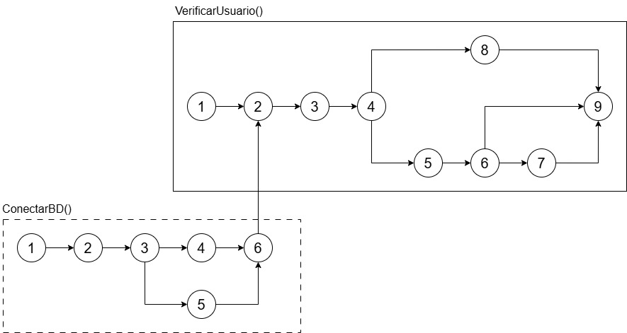

# Testes funcionais Caixa Branca UI/UX

### O código foi devidamente documentado?
Não, o código não apresenta comentários para a maioria das funções que implementa. O ideal seria descrever o retorno dos métodos chamados e o proósito das classes e resumir o fluxo principal do código.

### As variáveis e constantes possuem nomenclatura?
Sim, o código utiliza nomenclaturas coerentes com suas funções, como login, senha, nome, result, verificarUsuario e conectarDB

### Existem legibilidade e organização no código?
Pouco, não é uma boa prática manter a função de conexão em uma classe como a de usuário, a falta de comentários e espaçamento entre as linhas dificulta a legibilidade, a declaração da query sql não está padronizada e a separação por linha dificulta a legibilidade. Não existe tratamento de erro para as exceções.

### Todos os NullPointers foram tratados?
Não, o método para iniciar a conexão com o banco, getConnection, pode retornar null caso a conexão não tenha sucesso, fazendo com que o método conectarDB retorne null, e cause um erro posteriormente.

### As conexões utilizadas foram fechadas?
Não, as conexões abertas não foram fechadas, isso pode gerar consumo de recursos desnecessários ou exceder o limite de conexões com o banco.

## Notação de Grafo de Fluxo

### Descrição

**Método verificarUsuario**  

**N1** - Início do método  
**N2** - Chama o método conectarDB para receber o objeto de conexão  
**N3** - Monta query SQL  
**N4** - Entra no try  
**N5** - Roda a query através da conexão  
**N6** - Verfica se existe retorno do banco  
**N7** - Define a variável nome como o retornado pelo banco, e a variável result como true  
**N8** - Recebe a exceção em caso de erro  
**N9** - Retorna a variável result  

**Método conectarDB**

**N1** - Início do método  
**N2** - Inicializa variável do tipo Connection  
**N3** - Entra no try  
**N4** - Define a string de conexão com o banco e solicita a conexão   
**N5** - Recebe a exceção em caso de erro  
**N6** - Retorna o objeto de conexão  

## Complexidade Ciclomática

**Método verificarUsuario**  

**E (Arestas)** = 10  
**N (Nós)** = 9  
**P (Componentes)** = 1  

**M (Complexidade)** = 10 - 9 + 2 x 1 = **3**  

**Método concetarDB**  

**E (Arestas)** = 6  
**N (Nós)** = 6  
**P (Componentes)** = 1  

**M (Complexidade)** = 6 - 6 + 2 x 1 = **2**  

**Classe Usuário completa**  
 
**E (Arestas)** = 16  
**N (Nós)** = 15  
**P (Componentes)** = 2  

**M (Complexidade)** = 16 - 15 + 2 x 2 = **5**  

## Caminhos Básicos

**Método verificarUsuario - 3 Caminhos Básicos**  

**Caminho 1 *(Sem erro de exceção e resultado encontrado no banco)*:** 1 -> 2 -> 3 -> 4 -> 5 -> 6 -> 7 -> 9  
**Caminho 2 *(Sem erro de exceção e sem resultado encontrado no banco)*:** 1 -> 2 -> 3 -> 4 -> 5 -> 6 -> 9  
**Caminho 3 *(Com erro de exceção)*:** 1 -> 2 -> 3 -> 4 -> 8 -> 9   

**Método conectarDB - 2 Caminhos Básicos**  

**Caminho 1 *(Sem erro de exceção)*:** 1 -> 2 -> 3 -> 4 -> 6  
**Caminho 2 *(Com erro de exceção)*:** 1 -> 2 -> 3 -> 5 -> 6  
